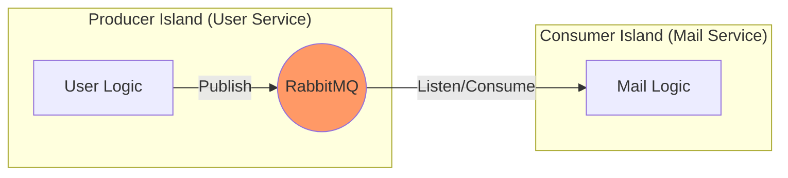

# 🐇 RabbitMQ in Microservices: The "Island" Analogy

This document explains why multiple services connect to RabbitMQ independently, even when the connection logic appears identical.

---

## 🏝️ 1. The "Island" Analogy
In a **Microservice Architecture**, each service (User, Mail, Chat) is its own independent "Island".

> [!IMPORTANT]
> **Islands do not share memory.** 
> Because they run in different processes (Ports 5000, 5002, etc.), they cannot see each other's variables or share a single "connection object".

### 📡 The Communication Flow

---

## 🎭 2. Different Roles, same "Phone"
Even though both services "dial the same number" (the RabbitMQ Host), their **intent** is the polar opposite.

### 📤 User Service (The Producer)
*   **Role**: The Sender.
*   **Action**: Pushes messages **INTO** the queue.
*   **Analogy**: Dropping a letter in a mailbox. It doesn't care who picks it up or when; its job is done once the letter is "posted".

### 📥 Mail Service (The Consumer)
*   **Role**: The Receiver.
*   **Action**: Pulls messages **FROM** the queue.
*   **Analogy**: The postman visiting the mailbox to see if there's work to do.

---

## 🧠 2.1 Why the Queue Matters in System Design
The queue is the central design element that makes this architecture scalable and resilient.
*   **Decoupling**: Producers and consumers do not need to be online at the same time. The queue stores work until a consumer can process it.
*   **Buffering**: Spikes in load are absorbed by the queue instead of overwhelming downstream services.
*   **Retry and durability**: Messages can be retried or persisted, so transient failures do not drop important events.
*   **Flexible scaling**: You can add more consumers later without changing producers, because they all read from the same queue.

This is the system-design significance of the queue: it is the shared durable handoff point that isolates service lifecycles and smooths traffic between independent services.

---

## 🛡️ 3. Resilience & Decoupling
One of the core strengths of this setup is **Independence**.

> [!TIP]
> If the **User Service** crashes, the **Mail Service** continues to stay connected, waiting patiently. When the User Service restarts, the "pipe" is restored automatically without the Mail Service ever needing to restart.

---

## � 3.1 How the Mail Service Knows a Message Arrived
The mail service does not keep checking the queue manually. Instead, it registers itself as a consumer.

### 🔄 The flow
1. The mail service connects to RabbitMQ and opens a channel.
2. It calls `channel.consume(queueName, callback)` to say: "Whenever a message arrives in this queue, call my callback."
3. When the user service publishes a message with `channel.sendToQueue(...)`, RabbitMQ delivers that message to the registered consumer.
4. The callback in the mail service receives the message, parses it, sends the email, and then calls `channel.ack(msg)` to confirm successful processing.

### 💡 In simple words
The mail service knows a message has arrived because RabbitMQ pushes it to the consumer callback. This is a push-based model, not a polling model.

If processing fails, the mail service can use `channel.nack(...)` to reject or requeue the message instead of acknowledging it.

---

## �📊 Summary of Roles

| Feature | User Service (`connectRabbitMQ`) | Mail Service (`startSendOtpConsumer`) |
| :--- | :--- | :--- |
| **Role** | **Producer** (Sender) | **Consumer** (Receiver) |
| **Primary Action** | `channel.sendToQueue` | `channel.consume` |
| **Memory State** | Isolated in Process A | Isolated in Process B |
| **Necessity** | Required to *speak* to the broker | Required to *listen* to the broker |

---

> [!CAUTION]
> Remember: In a distributed system, **nobody shares connections.** Everyone talks to the "Central Broker" (RabbitMQ) on their own merit.
