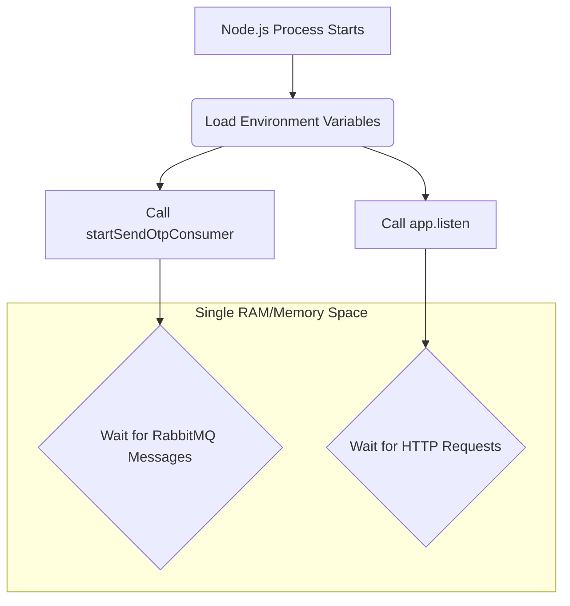

# 🏗️ Understanding Service Architecture & Execution Flow

This document explains the internal mechanics of a Node.js microservice, using the **Mail Service** as a reference.

---

### 📝 The Code: `backend/mail/src/index.ts`

```typescript
import express from 'express';
import {startSendOtpConsumer} from './consumer.js';
import dotenv from 'dotenv';

dotenv.config();

// Step 1: Initialize Background Tasks
startSendOtpConsumer();

// Step 2: Define Web Server
const app = express();

// Step 3: Activate Server
app.listen(process.env.PORT, () => {
    console.log(`Server is running on port ${process.env.PORT}`);
});
```

---

### 🚦 1. The Execution Lifecycle
When you run `node index.ts`, Node.js starts a **single Process** (a dedicated slot in your OS memory). It executes the code **sequentially** (from top to bottom).

#### **Step 1: Background Initialization (`startSendOtpConsumer`)**
*   **Significance**: This initiates a persistent "handshake" with the RabbitMQ broker. 
*   **Result**: The process is now "listening" for messages on a network socket. This happens *before* the web server even exists.

#### **Step 2: Defining the Web Server (`const app = express()`)**
*   **Significance**: This creates an object in the **RAM** of the current process. 
*   **Result**: The `app` object is now "roommates" with the RabbitMQ connection. They share the same memory space.

#### **Step 3: Activating the Server (`app.listen`)**
*   **Significance**: This tells the Operating System (Windows/Linux) to open a specific Port (e.g., 5003) for HTTP traffic.
*   **Result**: The process is now officially "Alive" and waiting for incoming requests.

---

### ❓ Why do we need `app.listen` in a Consumer?

You might wonder: *"If RabbitMQ is already listening for messages, why do we need the Express server at all?"*

#### **1. Process Persistence (The Heartbeat)**
In Node.js, if a script reaches the last line and has no "active handles" (like an open port), the process **exits**. While RabbitMQ *can* keep a process alive, `app.listen` is the industry standard for ensuring a service remains running 24/7.

#### **2. Health Checks & Orchestration**
Modern deployments (Docker, Kubernetes) need to monitor services. They periodically send a "Ping" (HTTP request).
- **Without Server**: The orchestrator can't "talk" to the service to see if it's healthy. It might assume it's crashed and restart it constantly.
- **With Server**: You can provide a `/health` endpoint that returns `200 OK`.

#### **3. Shared "Island" (Memory Space)**
Because `startSendOtpConsumer` and `app.listen` are in the same file, they run in the same **Execution Context**.

> [!IMPORTANT]
> **Co-existence**: It's not that `RabbitMQ` is "inside" the `Express Server`. Instead, both are **peers** running inside the same **Node.js Process**. They share the same environment variables, the same RAM, and the same CPU cycle.

---

### 🎨 Visual Flow


### 💡 Summary
Any function called in `index.ts` is running on the **same service engine**. The `app.listen` call acts as the "anchor" that keeps the engine running and provides a window (the port) for the outside world to check on the service's health.

---

### 🧠 Deep Dive: Memory Loading & Concurrent Execution

When you run `npm run dev`, you aren't just running code; you're initializing a complex environment. Here is exactly what happens in your RAM:

#### **Stage 1: The Bootloader (Nodemon/Process Start)**
*   **Action**: Your dev script (usually `nodemon`) tells the Operating System to "Spawn a Node.js Process".
*   **Memory**: The OS gives Node.js a slice of **RAM** (called the **Heap**). This is like a literal bucket of memory where everything will live.

#### **Stage 2: Module Loading (The "Once" Rule)**
*   **Action**: Node.js reads `import {startSendOtpConsumer} from './consumer.js'`.
*   **Mechanism**: Node finds the file, reads the code, and **executes it once**. 
*   **Result**: The functions and variables from `consumer.js` are converted into objects and placed into the **Heap**.
*   **Caching**: If you imported the same file 10 times, Node would NOT run it 10 times. It uses the version already sitting in the Heap. This is why all your functions "exist" before you even call them.

#### **Stage 3: The Event Loop (Handling Concurrency)**
This is the "magic" part. Node.js is **single-threaded** (it has only one CPU worker). How can it run a RabbitMQ Consumer AND a Web Server at the same time?

1.  **Registration**:
    *   When `startSendOtpConsumer()` runs, it says: *"Hey OS, if a message comes from RabbitMQ, trigger this callback."*
    *   When `app.listen()` runs, it says: *"Hey OS, if someone hits Port 5003, trigger this callback."*
2.  **The Event Loop**: Node.js then starts a loop (using a library called `libuv`). 
    *   It sits and waits. 
    *   If a RabbitMQ message arrives, the worker jumps to the **Consumer** code.
    *   If an HTTP request arrives, the worker jumps to the **Express** code.
    *   **Context Switching**: It switches between these so fast (in microseconds) that it **feels** like they are running independently and in parallel, even though there's only one worker thread.

#### **Stage 4: Variable Scope & Sharing**
Because everything lives in the same **Heap (RAM)**:
*   Vars in `index.ts` are globally accessible to the functions it calls.
*   The `channel` variable in `rabbitmq.ts` stays "alive" in memory as long as the process is running.
*   This is why after you call `connectMongoDb()`, any future route can use that connection—the "connection object" is just sitting there in the RAM bucket, ready to be used.

---

### 🖥️ The OS Connection: Memory & Ports

How does the **Windows/Linux OS** actually talk to your Node.js code? It happens through two primary mechanisms:

#### **1. The PID & Virtual Memory**
*   **Identification**: When you start the app, the OS assigns it a **Process ID (PID)** (e.g., PID 1245). This is like a unique Social Security Number for your running app.
*   **Memory Isolation**: The OS creates a "Virtual Memory" space for that PID. Your app thinks it has its own private playground of RAM, but the OS is actually mapping that to physical chips on your motherboard. 
*   **Protection**: Because of this isolation, if your **Chat Service** crashes, it cannot "mess up" the memory of your **User Service**. The OS acts as a wall between them.

#### **2. Port Binding (The Socket Table)**
*   **The System Call (Syscall)**: When `app.listen(5003)` is called, Node.js sends a "System Call" to the OS Kernel saying: *"I want to own Port 5003."*
*   **The Mapping**: The OS checks its **Socket Table**. If Port 5003 is free, it maps that port directly to your **PID**. 
*   **Traffic Routing**: When a request comes from the internet to Port 5003, the OS looks at its table, sees it belongs to your Node.js PID, and "pokes" the Event Loop to handle the data.

---

### 💡 Summary
Any function called in `index.ts` is running on the **same service engine**. The `app.listen` call acts as the "anchor" that keeps the engine running and provides a window (the port) for the outside world to check on the service's health.

---

> [!NOTE]
> **Why `npm run dev` is different:** 
> In "dev" mode, tools like `nodemon` watch your files. When you save a change, `nodemon` **kills the entire process** (clearing the RAM bucket) and starts over. This ensures you are always working with the freshest version of your memory objects.
