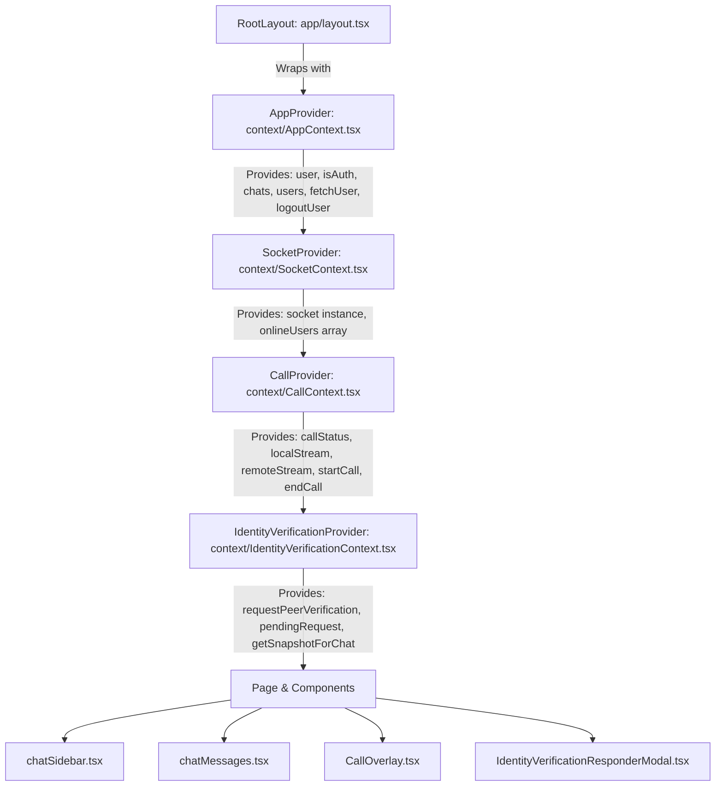

# State Management in Next.js: Redux vs. React Context API
> **Architectural Deep Dive & Real-World Case Study using the Pulse Chat Project**


-black?logo=next.js&logoColor=white)


---

## 📌 Table of Contents
1. [Overview & Executive Summary](#1-overview--executive-summary)
2. [High-Level Architectural Comparison](#2-high-level-architectural-comparison)
3. [The Pulse Application State Architecture](#3-the-pulse-application-state-architecture)
4. [Redux vs. Context: Conceptual Mapping](#4-redux-vs-context-conceptual-mapping)
5. [Side-by-Side Deep Dive (Pulse Codebase Examples)](#5-side-by-side-deep-dive-pulse-codebase-examples)
   - [5.1 Domain 1: Auth & User Session (`AppContext`)](#51-domain-1-auth--user-session-appcontext)
   - [5.2 Domain 2: Real-time WebSockets & Presence (`SocketContext`)](#52-domain-2-real-time-websockets--presence-socketcontext)
   - [5.3 Domain 3: WebRTC Audio/Video Call State Machine (`CallContext`)](#53-domain-3-webrtc-audiovideo-call-state-machine-callcontext)
   - [5.4 Domain 4: Ephemeral Verification & Modals (`IdentityVerificationContext`)](#54-domain-4-ephemeral-verification--modals-identityverificationcontext)
6. [Next.js App Router Integration & SSR Boundaries](#6-nextjs-app-router-integration--ssr-boundaries)
7. [Performance Engineering: Mitigating Re-render Bottlenecks](#7-performance-engineering-mitigating-re-render-bottlenecks)
8. [Decision Matrix: Redux vs. Context vs. External Stores](#8-decision-matrix-redux-vs-context-vs-external-stores)
9. [Quick Reference Cheat Sheet](#9-quick-reference-cheat-sheet)

---

## 1. Overview & Executive Summary

In traditional Single Page Applications (SPAs) built with React, **Redux** (or Redux Toolkit) has long been the default solution for global store management. It provides a centralized, immutable state tree, pure reducers, and predictable action dispatching.

However, modern **Next.js (App Router)** introduces Server Components, streaming, and granular client boundaries. In many modern full-stack web applications—such as our **Pulse Real-time Chat** system—introducing Redux adds heavy boilerplate, increases client bundle size, and complicates Server-Side Rendering (SSR) hydration.

> [!NOTE]
> By leveraging **React Context API + Custom Hooks + Modular Providers**, Next.js applications achieve **100% of Redux's state management capabilities** with:
> - Zero external state library dependencies (smaller bundle size).
> - Native compatibility with Next.js App Router client boundaries (`"use client"`).
> - Clean domain separation (Auth, Sockets, WebRTC, Modals).
> - Direct hook ergonomics (`useAppData()`, `SocketData()`, `useCall()`).

---

## 2. High-Level Architectural Comparison

### 2.1 The Redux Unidirectional Architecture vs. Next.js Modular Context Tree

```mermaid
flowchart TD
    subgraph Redux_Architecture["Redux Architecture (Monolithic Central Store)"]
        UI_R[React Component] -->|dispatch action| Dispatcher[Action Dispatcher / Thunk]
        Dispatcher -->|calls API / WebSockets| Middleware[Middleware / Side Effects]
        Middleware -->|updates| Reducers[Pure Reducers]
        Reducers -->|mutates immutably| RootStore[(Single Monolithic Store)]
        RootStore -->|useSelector| UI_R
    end

    subgraph Context_Architecture["Next.js Modular Context Architecture (Pulse Project)"]
        ServerLayout[app/layout.tsx (Server Component)] --> AppP[AppProvider (Auth, User, Chats)]
        AppP --> SocketP[SocketProvider (WebSocket & Online Presence)]
        SocketP --> CallP[CallProvider (WebRTC P2P Call State)]
        CallP --> IdP[IdentityVerificationProvider (Face AI Snapshots)]
        IdP --> ClientUI[Client Components: Sidebar, ChatMessages, CallOverlay, Modals]
        ClientUI -->|useAppData / SocketData / useCall| DomainContexts[Domain Context Hooks]
    end
```

### 2.2 Feature Comparison Matrix

| Feature / Criteria | Redux / Redux Toolkit (RTK) | React Context API in Next.js (Pulse Implementation) |
| :--- | :--- | :--- |
| **State Storage** | Single monolithic global store (`configureStore`) | Scoped, domain-driven modular providers (`AppContext`, `SocketContext`, etc.) |
| **Bundle Overhead** | ~40KB+ (`@reduxjs/toolkit`, `react-redux`) | **0 KB** (Built directly into React runtime) |
| **Next.js App Router Fit** | Requires client wrapper `<Provider store={store}>`, complex SSR store re-creation | **Native fit**: Server layout wraps `"use client"` providers cleanly |
| **Async Operations** | `createAsyncThunk`, RTK Query, or Redux-Saga | Native async/await inside context methods (`fetchChats()`, `startCall()`) |
| **Side Effects / Streams** | Custom Redux Middleware (e.g., custom socket middleware) | React `useEffect` + `useRef` (Direct WebRTC & Socket.IO event listeners) |
| **Consumer Ergonomics** | `useDispatch()`, `useSelector((state) => state.auth.user)` | Clean Custom Hooks: `const { user, fetchChats } = useAppData()` |
| **Boilerplate** | High (slices, action creators, reducers, type definitions) | **Low to Medium** (TypeScript interfaces + Provider + Hook) |
| **Non-Render State (Refs)** | Awkward to store non-serializable instances (`RTCPeerConnection`, `MediaStream`) | **Native**: `useRef<RTCPeerConnection>` pairs seamlessly inside the Provider |

---

## 3. The Pulse Application State Architecture

In Pulse, our real-time WhatsApp-style chat application, state is divided into **four specialized domain layers**. Instead of a single messy global state, each provider encapsulates its own business logic, Web APIs, and network subscriptions.



### Context Domains Breakdown

```
frontend/context/
├── AppContext.tsx                # 🔐 Core Session, User Profile, Conversation List (REST API)
├── SocketContext.tsx             # ⚡ Real-time Socket.IO Connection & Presence (WebSocket)
├── CallContext.tsx               # 📞 WebRTC P2P Video/Voice Call State Machine (Streams & RTCPeerConnection)
└── IdentityVerificationContext.tsx # 🛡️ Face-API Identity Verification & Modal Management
```

---

## 4. Redux vs. Context: Conceptual Mapping

When moving from Redux to React Context in Next.js, use this conceptual translation map:

```
┌───────────────────────────────────────────────────────────┬───────────────────────────────────────────────────────────┐
│                    REDUX / RTK CONCEPT                    │                NEXT.JS CONTEXT EQUIVALENT                 │
├───────────────────────────────────────────────────────────┼───────────────────────────────────────────────────────────┤
│ Store Configuration (`configureStore`)                    │ Provider Tree in Root Layout (`app/layout.tsx`)           │
│ Slice (`createSlice({ name, initialState, reducers })`)    │ Provider Component (`useState` / `useReducer`)            │
│ Action Creators & Reducer Functions                       │ Context State Setter functions / helper handlers          │
│ `createAsyncThunk` (Async API operations)                 │ Async functions inside Provider (`async function fetch()`)│
│ `useDispatch()`                                           │ Exposed functions returned by custom Context hook         │
│ `useSelector((state) => state.domain.value)`              │ Destructuring custom hook (`const { value } = useCall()`)  │
│ Redux Middleware (Socket / WebRTC event bridges)          │ `useEffect` lifecycle hooks inside Context Provider       │
│ Non-serializable state workaround                         │ `useRef` for MediaStream, PeerConnection, Timers          │
└───────────────────────────────────────────────────────────┴───────────────────────────────────────────────────────────┘
```

---

## 5. Side-by-Side Deep Dive (Pulse Codebase Examples)

Let's examine how each domain in Pulse would be structured in **Redux** versus how it is implemented in **Next.js Context**.

---

### 5.1 Domain 1: Auth & User Session (`AppContext`)

#### 🔴 The Redux Way: Slices + Thunks + Store Dispatch
In Redux, authentication requires multiple files: action types, asynchronous thunks, initial state, reducer cases, and dispatch hooks.

```typescript
// ❌ REDUX APPROACH: authSlice.ts
import { createSlice, createAsyncThunk } from "@reduxjs/toolkit";
import axios from "axios";

export const fetchCurrentUser = createAsyncThunk("auth/fetchUser", async () => {
  const { data } = await axios.get("/api/v1/me");
  return data;
});

const authSlice = createSlice({
  name: "auth",
  initialState: { user: null, isAuth: false, loading: true },
  reducers: {
    setUser: (state, action) => { state.user = action.payload; },
    logout: (state) => { state.user = null; state.isAuth = false; }
  },
  extraReducers: (builder) => {
    builder
      .addCase(fetchCurrentUser.pending, (state) => { state.loading = true; })
      .addCase(fetchCurrentUser.fulfilled, (state, action) => {
        state.user = action.payload;
        state.isAuth = true;
        state.loading = false;
      })
      .addCase(fetchCurrentUser.rejected, (state) => {
        state.loading = false;
      });
  }
});
```

#### 🟢 The Next.js Context Way: `AppContext.tsx` (Pulse Production Code)
With Context, everything is unified into a cohesive, readable, typed module:

```tsx
// ✅ PULSE IMPLEMENTATION: frontend/context/AppContext.tsx
"use client";

import { createContext, ReactNode, useContext, useEffect, useState } from "react";
import axios from "axios";
import toast, { Toaster } from "react-hot-toast";

export interface User {
  _id: string;
  name: string;
  email: string;
  profilePic?: { url: string; publicId: string };
}

export interface Chats {
  _id: string;
  user: User;
  chat: any;
}

interface AppContextType {
  user: User | null;
  loading: boolean;
  isAuth: boolean;
  chats: Chats[] | null;
  users: User[] | null;
  setUser: React.Dispatch<React.SetStateAction<User | null>>;
  setIsAuth: React.Dispatch<React.SetStateAction<boolean>>;
  logoutUser: () => Promise<void>;
  fetchUsers: () => Promise<void>;
  fetchChats: () => Promise<void>;
  updateProfile: (name: string) => Promise<void>;
  refreshUser: () => Promise<User | null>;
}

const AppContext = createContext<AppContextType | undefined>(undefined);

export const AppProvider: React.FC<{ children: ReactNode }> = ({ children }) => {
  const [user, setUser] = useState<User | null>(null);
  const [isAuth, setIsAuth] = useState(false);
  const [loading, setLoading] = useState(true);
  const [chats, setChats] = useState<Chats[] | null>(null);
  const [users, setUsers] = useState<User[] | null>(null);

  async function fetchUser() {
    try {
      const { data } = await axios.get(`${user_service}/api/v1/me`);
      setUser(data);
      setIsAuth(true);
    } catch (error) {
      console.error(error);
    } finally {
      setLoading(false);
    }
  }

  async function logoutUser() {
    try {
      await axios.post(`${user_service}/api/v1/logout`);
      setUser(null);
      setIsAuth(false);
      toast.success("User Logged Out");
    } catch (error) {
      setUser(null);
      setIsAuth(false);
    }
  }

  useEffect(() => {
    fetchUser();
    fetchChats();
  }, []);

  return (
    <AppContext.Provider
      value={{ user, setUser, isAuth, setIsAuth, loading, logoutUser, fetchChats, chats, users, refreshUser, updateProfile, fetchUsers }}
    >
      {children}
      <Toaster position="top-center" />
    </AppContext.Provider>
  );
};

// Custom ergonomic hook
export const useAppData = (): AppContextType => {
  const context = useContext(AppContext);
  if (!context) throw new Error("useAppData must be used within AppProvider");
  return context;
};
```

---

### 5.2 Domain 2: Real-time WebSockets & Presence (`SocketContext`)

Managing WebSocket client singletons in Redux requires creating a custom middleware to intercept socket events and dispatch actions into the store. In Next.js Context, the connection lifecycle binds directly to user authentication.

#### 🔴 The Redux Way: Complex Custom Socket Middleware
```typescript
// ❌ REDUX: Custom middleware needed to listen to socket events
const socketMiddleware = (socket) => (store) => (next) => (action) => {
  if (action.type === "socket/connect") {
    socket.connect();
    socket.on("getOnlineUser", (users) => {
      store.dispatch(setOnlineUsers(users));
    });
  }
  return next(action);
};
```

#### 🟢 The Next.js Context Way: `SocketContext.tsx` (Pulse Production Code)
```tsx
// ✅ PULSE IMPLEMENTATION: frontend/context/SocketContext.tsx
"use client";

import { ReactNode, useContext, useEffect, useState, createContext } from "react";
import { io, Socket } from "socket.io-client";
import { chat_service, useAppData } from "./AppContext";

interface SocketContextType {
  socket: Socket | null;
  onlineUsers: string[];
}

const SocketContext = createContext<SocketContextType>({
  socket: null,
  onlineUsers: [],
});

export const SocketProvider = ({ children }: { children: ReactNode }) => {
  const [socket, setSocket] = useState<Socket | null>(null);
  const { user } = useAppData(); // Seamlessly consumes parent context!
  const [onlineUsers, setOnlineUsers] = useState<string[]>([]);

  useEffect(() => {
    if (!user?._id) return;

    // 1. Initialize persistent socket instance for authenticated user
    const newSocket = io(chat_service, {
      query: { userId: user._id }
    });

    setSocket(newSocket);

    // 2. Real-time online user presence listener
    newSocket.on("getOnlineUser", (users: string[]) => {
      setOnlineUsers(users);
    });

    // 3. Automatic cleanup on logout/unmount
    return () => {
      newSocket.disconnect();
    };
  }, [user?._id]);

  return (
    <SocketContext.Provider value={{ socket, onlineUsers }}>
      {children}
    </SocketContext.Provider>
  );
};

export const SocketData = () => useContext(SocketContext);
```

> [!TIP]
> **Context Composition Superpower**: `SocketProvider` can directly call `useAppData()` to read the authenticated `user._id`. In Redux, coordinating cross-slice state and socket initialization requires complex thunk orchestration or middleware state inspection.

---

### 5.3 Domain 3: WebRTC Audio/Video Call State Machine (`CallContext`)

WebRTC requires managing non-serializable objects: `RTCPeerConnection`, `MediaStream` (audio/video tracks), and ICE candidate queues. 

> [!WARNING]
> **Redux Serializability Rule**: Redux strictly discourages storing non-serializable objects (like `RTCPeerConnection` or `MediaStream`) in the store. Putting them in Redux causes warnings, breaks time-travel debugging, and degrades performance.

#### 🟢 The Next.js Context Solution: `CallContext.tsx`
Context solves this elegantly by combining React `useState` (for UI reactive state) with `useRef` (for WebRTC objects).

```tsx
// ✅ PULSE IMPLEMENTATION: frontend/context/CallContext.tsx (Simplified Excerpt)
"use client";

import React, { createContext, useCallback, useContext, useEffect, useRef, useState, ReactNode } from "react";
import { useAppData, User } from "./AppContext";
import { SocketData } from "./SocketContext";
import { CallType, ICE_SERVERS, getMediaConstraints, stopMediaStream } from "@/lib/webrtc";
import type { CallPeer, CallStatus } from "@/lib/callTypes";

interface CallContextType {
  callStatus: CallStatus;           // "idle" | "outgoing" | "incoming" | "active"
  callType: CallType | null;        // "audio" | "video"
  remotePeer: CallPeer | null;
  isMuted: boolean;
  isCameraOff: boolean;
  localStream: MediaStream | null;
  remoteStream: MediaStream | null;
  startCall: (peer: User, type: CallType) => Promise<void>;
  acceptCall: () => Promise<void>;
  rejectCall: () => void;
  endCall: () => void;
  toggleMute: () => void;
  toggleCamera: () => void;
}

const CallContext = createContext<CallContextType | null>(null);

export function CallProvider({ children }: { children: ReactNode }) {
  const { user: loggedInUser } = useAppData();
  const { socket } = SocketData();

  // Reactive UI states
  const [callStatus, setCallStatus] = useState<CallStatus>("idle");
  const [callType, setCallType] = useState<CallType | null>(null);
  const [remotePeer, setRemotePeer] = useState<CallPeer | null>(null);
  const [localStream, setLocalStream] = useState<MediaStream | null>(null);
  const [remoteStream, setRemoteStream] = useState<MediaStream | null>(null);

  // Non-rendering mutable refs (Instances that shouldn't trigger re-renders on change)
  const pcRef = useRef<RTCPeerConnection | null>(null);
  const localStreamRef = useRef<MediaStream | null>(null);

  // Reusable signaling listeners
  useEffect(() => {
    if (!socket) return;

    socket.on("call:offer", (data) => {
      setRemotePeer(data.caller);
      setCallType(data.callType);
      setCallStatus("incoming");
    });

    socket.on("call:end", () => cleanup());

    return () => {
      socket.off("call:offer");
      socket.off("call:end");
    };
  }, [socket]);

  return (
    <CallContext.Provider value={{
      callStatus, callType, remotePeer, localStream, remoteStream,
      startCall, acceptCall, rejectCall, endCall, toggleMute, toggleCamera,
      isMuted, isCameraOff
    }}>
      {children}
    </CallContext.Provider>
  );
}

export const useCall = () => {
  const ctx = useContext(CallContext);
  if (!ctx) throw new Error("useCall must be used within CallProvider");
  return ctx;
};
```

---

### 5.4 Domain 4: Ephemeral Verification & Modals (`IdentityVerificationContext`)

For AI Face verification (`face-api.js`), we manage snapshot verification results, incoming verification modals, and push notification triggers:

```tsx
// ✅ PULSE IMPLEMENTATION: frontend/context/IdentityVerificationContext.tsx
export function IdentityVerificationProvider({ children }: { children: ReactNode }) {
  const [incomingRequest, setIncomingRequest] = useState<VerificationRequestPayload | null>(null);
  const [pendingRequest, setPendingRequest] = useState<PendingVerificationRequest | null>(null);

  return (
    <IdentityVerificationContext.Provider value={{
      requestPeerVerification, cancelPendingRequest, pendingRequest, getSnapshotForChat, dismissSnapshotView
    }}>
      {children}
      {/* Modal renders globally above all pages */}
      {incomingRequest && loggedInUser && (
        <IdentityVerificationResponderModal
          request={incomingRequest}
          loggedInUser={loggedInUser}
          onClose={() => setIncomingRequest(null)}
          onDecline={declineIncoming}
        />
      )}
    </IdentityVerificationContext.Provider>
  );
}
```

---

## 6. Next.js App Router Integration & SSR Boundaries

Next.js 13+ App Router runs layouts and pages as **Server Components (RSC)** by default. Server Components cannot hold state or use React Context.

### How Pulse Configures Providers in `app/layout.tsx`

```tsx
// ✅ PULSE IMPLEMENTATION: frontend/app/layout.tsx
import type { Metadata } from "next";
import { Plus_Jakarta_Sans } from "next/font/google";
import "./globals.css";

// Import all Context Providers (Each marked with "use client")
import { AppProvider } from "@/context/AppContext";
import { SocketProvider } from "@/context/SocketContext";
import { CallProvider } from "@/context/CallContext";
import { IdentityVerificationProvider } from "@/context/IdentityVerificationContext";

// Global Overlay Components
import ThemeToggle from "@/components/ThemeToggle";
import PushNotifications from "@/components/PushNotifications";
import CallOverlay from "@/components/CallOverlay";

export const metadata: Metadata = {
  title: "Pulse — Real-time messaging",
  description: "Modern real-time communication platform",
};

export default function RootLayout({
  children,
}: Readonly<{
  children: React.ReactNode;
}>) {
  return (
    <html lang="en" suppressHydrationWarning>
      <body suppressHydrationWarning className="font-sans antialiased">
        {/* Modular Layered Provider Tree */}
        <AppProvider>
          <SocketProvider>
            <CallProvider>
              <IdentityVerificationProvider>
                <ThemeToggle />
                <PushNotifications />
                <CallOverlay />
                {children}
              </IdentityVerificationProvider>
            </CallProvider>
          </SocketProvider>
        </AppProvider>
      </body>
    </html>
  );
}
```

### Key Architectural Benefits of this Layout Pattern:
1. **Server Layout remains fast & SEO friendly**: Fonts, metadata, and HTML tags render on the server.
2. **Persistent state across client navigation**: When a user switches between `/chat/123` and `/chat/456`, the `SocketProvider` connection and active `CallProvider` WebRTC stream **never re-mount or disconnect**.
3. **Global Overlays rendered at root**: Components like `<CallOverlay />` and `<PushNotifications />` can display incoming calls or alerts anywhere in the application without prop drilling.

---

## 7. Performance Engineering: Mitigating Re-render Bottlenecks

A common criticism of React Context vs Redux is: *"Whenever a context value changes, all consumer components re-render."*

Here is how Pulse optimizes context performance to match Redux selector efficiency:

### Strategy 1: Domain-Specific Context Splitting
Instead of putting `user`, `messages`, `socket`, `onlineUsers`, and `callStatus` in one giant Context, we split them into **4 isolated domains**.
- When `onlineUsers` changes in `SocketContext`, the `CallContext` and `IdentityVerificationContext` **do not re-render**.
- When `callStatus` transitions from `"idle"` to `"active"`, `AppContext` (user chats) is unaffected.

### Strategy 2: `useCallback` & `useMemo` on Provider Values
Functions provided to context should be wrapped in `useCallback` to prevent new function references on every render:

```tsx
const endCall = useCallback(() => {
  const peerId = remotePeer?._id;
  if (peerId && socket) {
    emitToPeer("call:end", peerId);
  }
  cleanup();
}, [remotePeer?._id, socket, emitToPeer, cleanup]);
```

### Strategy 3: Using `useRef` for Volatile Non-UI State
WebRTC ICE candidate buffering and peer connections are stored in `useRef` rather than `useState`:
```tsx
const pcRef = useRef<RTCPeerConnection | null>(null);
const pendingIceRef = useRef<RTCIceCandidateInit[]>([]);
```
Updating `pendingIceRef.current.push(candidate)` executes instantly with **0 component re-renders**.

---

## 8. Decision Matrix: Redux vs. Context vs. External Stores

| Scenario / App Type | Recommended Approach | Why? |
| :--- | :--- | :--- |
| **Real-time Chat / Collaboration (e.g., Pulse)** | **React Context API (Modular)** | Native WebRTC/WebSocket support, clean domain separation, zero bundle overhead. |
| **Next.js App Router Microservices UI** | **React Context API** | Seamless compatibility with RSC, client boundaries, and fast server rendering. |
| **Massive Enterprise Dashboards (500+ global fields changing per second)** | **Zustand / Redux Toolkit** | Granular atom/selector subscriptions to prevent re-renders on hyper-frequent updates. |
| **Local Component / Dialog State** | **`useState` / `useReducer`** | No global state needed. |

---

## 9. Quick Reference Cheat Sheet

### Consuming Context in Any Client Component

```tsx
// frontend/components/chatSidebar.tsx
import { useAppData } from "@/context/AppContext";
import { SocketData } from "@/context/SocketContext";
import { useCall } from "@/context/CallContext";

export default function ChatSidebar() {
  // 1. Read User & Chat state
  const { user, chats, fetchChats } = useAppData();

  // 2. Read Real-time Presence
  const { onlineUsers } = SocketData();

  // 3. Trigger WebRTC Call
  const { startCall } = useCall();

  return (
    <aside className="sidebar">
      <h2>Welcome, {user?.name}</h2>
      <button onClick={() => startCall(recipientUser, "video")}>
        Start Video Call
      </button>
    </aside>
  );
}
```

---

## 💡 Summary

By adopting a **Layered Domain Context Architecture** (`AppContext` → `SocketContext` → `CallContext` → `IdentityVerificationContext`), Pulse achieves all the capabilities of Redux:
- **Centralized Data Access** without prop drilling.
- **Predictable Asynchronous Actions** (API calls, WebSockets, WebRTC).
- **Zero Third-Party Store Dependencies**, keeping the Next.js bundle lightweight and blazing fast.
